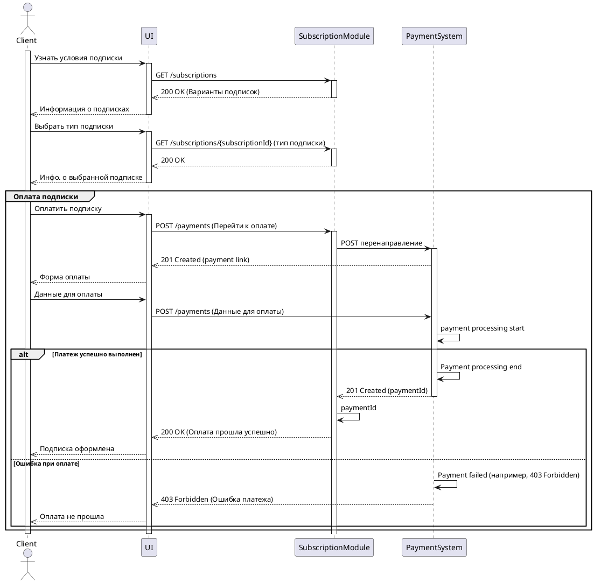

# Sequence diagram

Диаграмма для сценария оформления подписки

## Описание алгоритма

**Запрос условий подписки**:
- **Client** запрашивает информацию о доступных типах подписок через **UI**.
- **UI** отправляет GET-запрос на /subscriptions в **SubscriptionModule**.
- **SubscriptionModule** отвечает с кодом 200 OK и возвращает список доступных вариантов подписок.
- **UI** отображает **Client** информацию о доступных подписках.

**Выбор подписки**:
- **Client** выбирает один из предложенных вариантов подписки.
- **UI** отправляет запрос на  /subscriptions/{subscriptionId} , чтобы получить подробности о выбранной подписке.
- **SubscriptionModule** отвечает с кодом 200 OK, предоставляя информацию о выбранной подписке.
- **UI** отображает **Client** подробности о выбранной подписке.

**Оплата подписки**:
- **Client** решает оплатить выбранную подписку.
- **UI** инициирует запрос на создание платежа через **SubscriptionModule**, отправив POST-запрос на /payments.
- **SubscriptionModule** перенаправляет запрос в **PaymentSystem** с помощью POST-запроса.
- **PaymentSystem** обрабатывает запрос и возвращает статус 201 Created, предоставляя ссылку для оплаты.
- **UI** получает ссылку и отображает **Client** форму для ввода данных оплаты.

**Процессинг платежа**:
- **Client** вводит данные для оплаты и отправляет их через **UI**.
- **UI** отправляет данные на **PaymentSystem** для обработки.
- **PaymentSystem** начинает обработку платежа.

**Если платеж успешный**:
- **PaymentSystem** завершает обработку платежа (платёж прошел успешно).
- **PaymentSystem** отправляет уведомление о завершении обработки (статус 201 Created) с идентификатором платежа.
- **SubscriptionModule** получает идентификатор платежа и завершает процесс оплаты.
- **UI** сообщает **Client**, что оплата прошла успешно, и подписка оформлена.

**Если платеж неудачный**:
- Если платёж не был обработан успешно (например, ошибка 403 Forbidden), **PaymentSystem** возвращает ошибку.
- **UI** получает информацию об ошибке и сообщает **Client**, что оплата не прошла.
