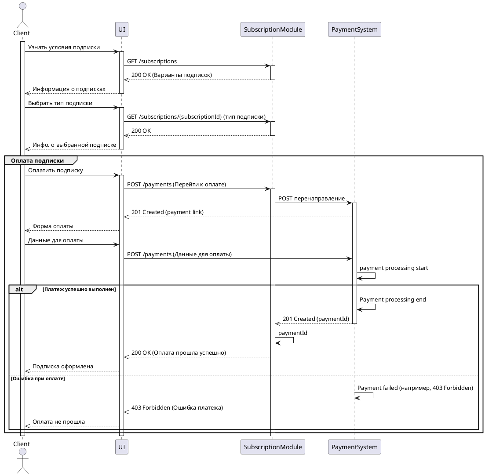

# Sequence diagram

Диаграмма для сценария оформления подписки

```plantuml

@startuml

actor Client
participant UI
participant "SubscriptionModule" as s
participant "PaymentSystem" as ps

activate Client
Client -> UI: Узнать условия подписки
activate UI
UI -> s: GET /subscriptions
activate s
UI <<-- s: 200 OK (Варианты подписок)
deactivate s
Client <<-- UI: Информация о подписках
deactivate UI

Client -> UI: Выбрать тип подписки
activate UI
UI -> s: GET /subscriptions/{subscriptionId} (тип подписки)
activate s
UI <<-- s: 200 OK
deactivate s
Client <<-- UI: Инфо. о выбранной подписке
deactivate UI

Group Оплата подписки
Client -> UI: Оплатить подписку
activate UI
UI -> s: POST /payments (Перейти к оплате)
activate s
s -> ps: POST перенаправление
activate ps
UI <<-- ps: 201 Created (payment link)
Client <<-- UI: Форма оплаты
Client -> UI: Данные для оплаты
UI -> ps: POST /payments (Данные для оплаты)
ps -> ps: payment processing start

alt Платеж успешно выполнен
ps -> ps: Payment processing end
s <<-- ps: 201 Created (paymentId)
deactivate ps
s -> s: paymentId 
UI <<-- s: 200 OK (Оплата прошла успешно)
Client <<-- UI: Подписка оформлена
else Ошибка при оплате
ps -> ps: Payment failed (например, 403 Forbidden)
UI <<-- ps: 403 Forbidden (Ошибка платежа)
Client <<-- UI: Оплата не прошла
end

end
deactivate UI
deactivate Client

@enduml


```
