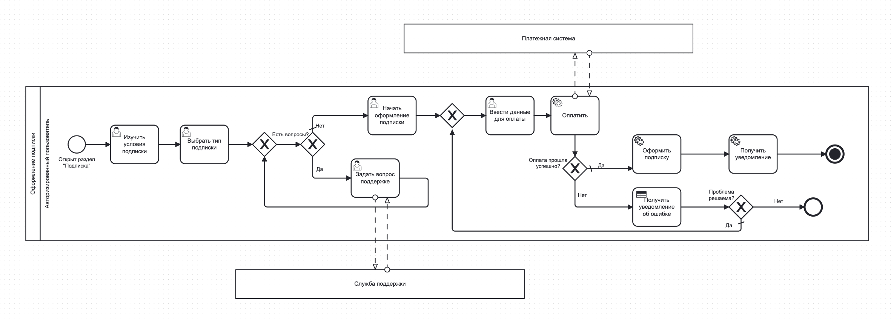
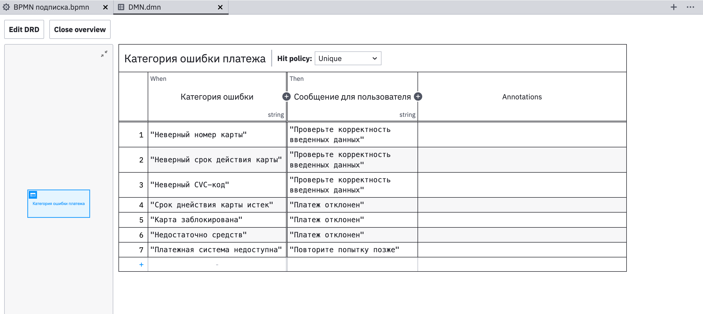

Рассмотрим функционал оформления подписки на сервис

DMN таблица
Использование DMN кажется обоснованным на одном из шагов оплаты подписки. 
В случае когда оплата подписки не прошла успешно, пользователь должен получить уведомление о том, какая именно ошибка произошла на этом этапе. В ходе разработки системы мы заранее заложим в логику альтернативные сценарии с разными вариантами ошибок и ответом для пользователя. 
В зависимости от того, окажется ли ошибка решаемой, процесс либо завершится, либо вернется на шаг назад для повторной попытки оплаты.

