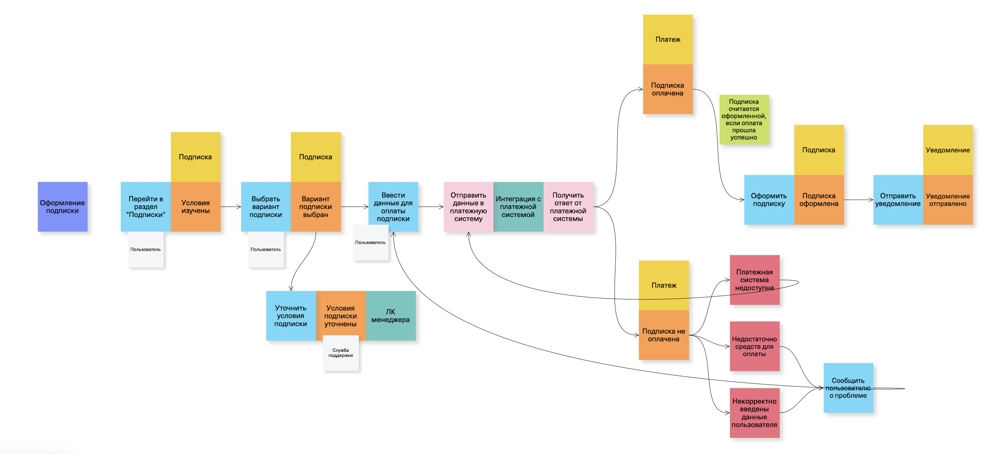

# Сбор требований

В данном разделе можно ознакомиться с артефактами для подготовки к сбору требований: классификацией стейкхолдеров по матрице RACI, списком вопросов для интервью, схемой Event Storming для описания обсуждаемого бизнес-процесса

## **Классификация стейкхолдеров по матрице RACI**

Будем собирать требования для процесса оформления подписки на сервис.

Ниже описаны два пути классификации стейкхолдеров. Первый основывается на самих этапах создания нужного ПО. Второй же сфокусирован больше на зонах ответственности стейкхолдеров при выявлении требований. Поэтому получилось две матрицы в разных подходах

### 1-й вариант

|Оформление подписки|PM|СА|TL|Devs|QA|Дизайнер|ИБ|Маркетинг|
|-|-|-|-|-|-|-|-|-|
|Сбор и анализ требований|A|R|I|I|I|C|C|C|
|Документирование|A|R|C|C|C|I|I|I|
|UI-дизайн|A|C|I|I|I|R|I|C|
|Проектирование/разработка системы|I|C|A|R|I|I|I|I|
|Интеграция с платежной системой|I|C|A|R|C|I|R|I|
|Тестирование|I|C|A|C|R|C|I|I|
|Вывод в прод|C|C|A|R|C|I|I|I|

Роль каждого стейкхолдера в процессе принятия решений и реализации функционала:
- Продакт менеджмер - отвечает за общее видение продукта и соответствие бизнес-целям. Приоритизирует требования и задачи для их выполнения. Принимает работу на разных этапах, несет ответственность за общий результат. 
- СА - включен во все этапы работы над проектом. Ответственен за сбор, анализ, документирование требований. Консультирует остальных участников на этапах дизайна, проектирования, тестирования и вывода системы в прод.
- ТимЛид - принимает техническую часть работу и несет ответственность за результат разработки, тестирования и вывода системы в прод. На этапе документирования требований консультирует по техническим нюансам реализации. 
- Разработчики - выполняют хадания по разработке и интеграциям системы, выводу в прод. На этапе документирования требований могут предлагать решения и консультировать по техническим нюансам реализации. Включены в этап тестирования, могут консультировать тестировщика по разработанным решениям, исправлять найденные баги.
- QA - выполняют задачи на этапе тестирования. Консультируют на этапе документирвоания требований, также могут добавлять тест-планы, тест-кейсы для последующего тестирования. 
- Дизайнер - выполняет задание по дизайну пользовательских интерфейсов. На этапе сбора и анализа требований может помочь с выявлением потребностей пользователей, т.к. обладает экспертизой в UX/UI-исследованиях. На этапе тестирования также может консультирровать тестировщиков по конечному виду продукта.
- ИБ - выполняют задания на этапе интеграции с платежной системой, следят за юридическими аспектами взаимодействия и отвечают за безопасность. На этапе сбора и анализа требований также могут стать источником требований. 
- Маркетинг - будут полезны при сборе и анализе требований, дизайне пользовательских интерфейсов, т.к. владеют информацией о рынке и о конкурентах; имеют хорошее понимание для определения конкурентных преимуществ продукта

### 2-й вариант

|Оформление подписки|Продакт менеджер|Пользователь сервиса|Заказчик|Команда разработки|
|-|-|-|-|-|
|Формирование условий подписки|A|C|R|I|
|Формирование процесса оформления подписки|RA|C|C|C|
|Интеграция с платежной системой|A|I|C|R|
|Формирование процесса отмены подписки|RA|C|C|C|

- Продакт-менеджер - главное действующее лицо данной класификации. Он формирует концептуальное видение основных шагов активности "оформление подписки" и несет ответственность за полученный результат.
- Пользователи сервиса - те, кто будет оформлять для себя подписку. Важны их потребности и пожелания от взаимодействия с функционалом. Необходимо понять, какую информацию они хотят видеть перед оформление подписки, какие шаги готовы совершить для оформления и отмены подписки. 
- Заказчики - тот круг лиц, которые и формируют условия подписки. Также могут поделиться ценной информацией, касающеся бизнес-правил или ограничений на этапах оформления и отмены подписки, взаимодейтсвия с платежными сервсиами для ее оплаты.
- Команда разработки - технически реализуют интеграцию с платежным сервисом. Также участвуют в процессе формирования решения для реализации бизнес-логики в процессах оформления и отмены подписки.

## Список вопросов для интервью

Рассмотрим функционал оформления подписки на сервис.

### Вопросы для заказчика:
1. Каких целей вы хотите достичь, внедрив опцию оформления подписки на сервис? (Цель вопроса: понять ожидания заказчика от процесса оформления подписки)
2. Какую информацию о подписке вы хотите транслировать пользователям? (Цель вопроса: узнать, что стейкхолдер хочет видеть в системе)
3. Будет ли у пользователя возможность выбрать тип подписки? Если да, то как он сможет это сделать? (Цель вопроса: узнать, что стейкхолдер хочет видеть в системе)
4. Как вы планируете оценивать/измерять эффективность процесса оформления подписки? (Цель вопроса: понять, как заказчик будет оценивать успешность процесса оформления подписки) 
5. Какие риски вы видите в процессе оформления подписки? (Цель вопроса: понять, чего заказчик опасается при реализации функциолнала) 

### Вопросы для пользователей:
1. Какую информацию о подписке вы хотите видеть? (Цель вопроса: при реализации решения попасть в запрос пользователя, дав ему необходимую информацию для перехода к оформлению подписки).
2. Что для вас наиболее важно при оформлении подписки (например, полнота информации об условиях, простота или скорость самого процесса оформления)? (Цель вопроса: понять, на что пользовтаель обращает внимание в процессе оформления)
3. На что вы обычно обращаете внимание при выборе типа подписки? (Цель вопроса: учесть опыт пользователей при проектировании интерфейса для повышения конверсии перехода к оформлению подписки).
4. Каким способом вам удобно оплатить подписку? (Цель вопроса: узнать о потребностях пользователя, чтобы ссоздать удобное востребованное решение).
5. Возникают ли обычно проблемы с оформлением или оплатой подписки? если да, то какие?  (Цель вопроса: больше узнать о возникающих проблемах и детальнее проработать альтернативные сценарии).
6. Что может заставить вас передумать оформлять подписку? (Цель вопроса: понять, что отталкивает пользователя от приобретения подписки и постараться минимизировать эти факторы при реализации решения). 
7. Важно ли для вас наличие возможности оформления пробного периода использования подписки? (Цель вопроса: понять, может ли отсутствие пробного периода подписки негативно сказаться на решении пользователя оформить подписку)

### Вопросы для информационной безопсности:
1. Какие нормативнно-правовые акты мы должны соблюдать при работе с данными пользователей и платежей? 
2. Какие меры безопасности в данный момент применяются при работе с личными данными пользователей?
3. Какой уровень шифрования вы рекомендуете использовать для хранения данных о платежах по подписке?
Цель вопросов: понять, какие факторы со стороны инфобеза мы должны учесть при проектировании решения.

## **Event Storming для бизнес-процесса**

Рассмотрим функционал оформления подписки на сервис.

Ссылка на [unidraw](https://unidraw.io/board/f1b7cf2bc697c5edd23d)

