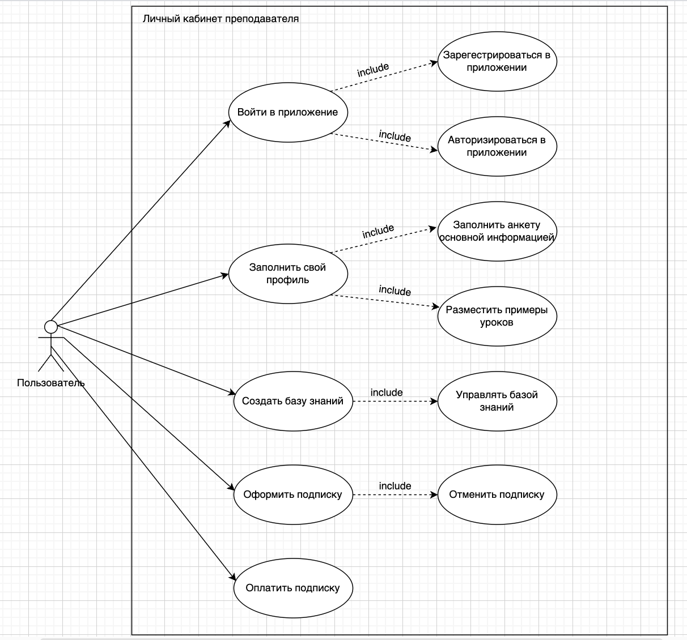

# Личный кабинет преподавателя

Рисунок 1. Диаграмма Use Case для версии 1.0 учебной платформы

#### UC 1. Вход пользователя в личный кабинет.
Цель: Войти в личный кабинет пользователя.
Участники: Преподаватель (далее Пользователь). Веб-сайт учебной платформы (далее Система).
Предусловие: Пользователь зарегестрирован в Системе. 
Триггер: Пользователь зашел на веб-сайт учебной платформы.
Основной сценарий:
1. Система отображает экран входа с полями для ввода логина и пароля.
2. Пользователь заполняет поле "Логин"
3. Пользователь заполняет поле "Пароль".
4. Пользователь нажимает кнопку "Войти".
5. Система проверяет введенные данные для входа.
6. Система проводит авторизацию Пользователя.
7. Система отображает сообщение об успешном входе.
Альтернативный сценарий:
3а.1. Пользователь ввел некорректный пароль.
3а.2. Система отображает сообщение об ошибке "Неправильный логин или пароль".
3а.3. Пользователь наживает на кнопку "Забыли пароль"
3а.4. Система открывает окно для восстановления пароля. 
Постусловие: Пользователь успешно зашел в свой личный кабинет в Системе.

#### WIP

Тут будут описаны Use Case
