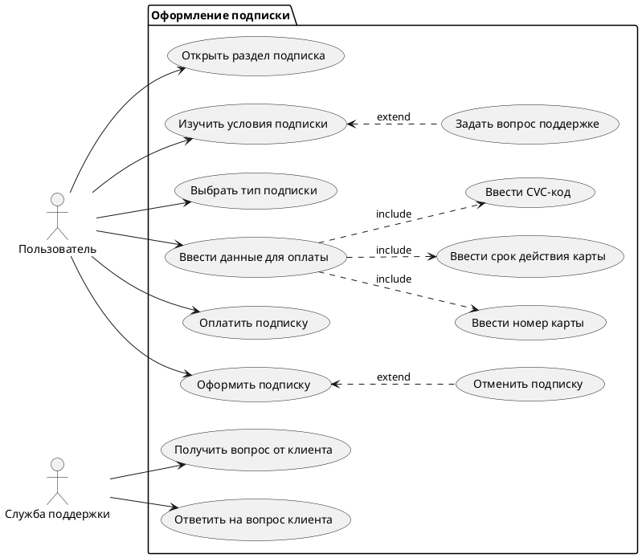

# Сценарий оформления подписки



## Описание алгоритма

```plantuml

@startuml

actor Client
participant UI
participant Back
participant "Payment system" as ps

activate Client
Client -> UI: Узнать условия подписки
activate UI
Client <<-- UI: Условия подписки
deactivate UI
Client -> UI: Выбрать тип подписки
activate UI
UI -> Back: Зафиксировать выбор
activate Back
UI <<-- Back: Выбор зафиксирован
deactivate Back
Client <<-- UI: Тип подписки выбран
deactivate UI

Group Оплата подписки
Client -> UI: Ввести данные для оплаты
activate UI
UI -> Back: Данные для оплаты
activate Back
Back -> ps: Запрос платежа
activate ps
alt Платеж выполнен
Back <<-- ps: Платеж выполнен
deactivate ps
UI <<-- Back: Оплата прошла успешно
deactivate Back
Client <<-- UI: Подписка оформлена
else Платеж не выполнен
Back <<-- ps: Ошибка платежа
deactivate ps
UI <<-- Back: Оплата не прошла
deactivate Back
Client <<-- UI: Попробуйте снова
end
end

deactivate UI
deactivate Client

@enduml