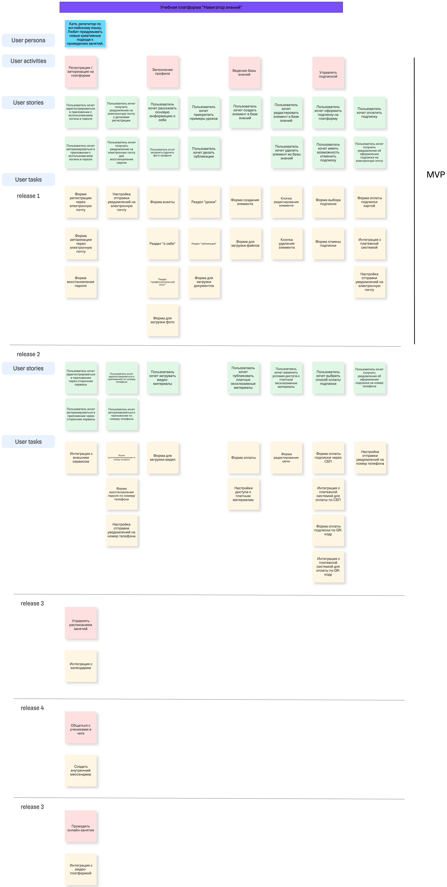

# Концепция и границы проекта

Название проекта: Образовательная система **«Навигатор знаний».**

Краткое описание: Платформа для поиса репетиторов и учеников.

## Бизнес требования

### 1. Описание проблемы

Продукт решает проблему подбора репетиторов для учеников, и подбора учеников для репетиторов соответственно.

В существующих на рынке решениях отсутствует полнота картины об опыте и методах преподавания конкретно взятого репетитора. На платформах конкурентов ученик, находящийся в поиске преподавателя, может ознакомиться лишь с базовой информацией об его опыте и поле деятельности, прослушать аудио дорожку с самопрезентацией репетитора и перейти по разным ссылкам на соц-сети, чтобы ознакомиться с визуальными материалами. Все это создает лишние действия и не помогает глубоко познакомиться с кандидатом в репетиторы. 

Со стороны репетиторов также присутствуют проблемы при наборе учеников. Одни существующие решения (например, Skyeng) берут большую комиссию за проводимые с использованием их платформы занятия и выставляют рамки на формат проведения уроков. Другие решения по поиску учеников (например, Profi.ru) берут плату за каждый отклик на ученика, не учитывая факт того, состоится ли вообще дальнейший диалог с этим конкретным учеником. Таким образом, частные репетиторы теряют весомый процент своей потенциальной прибыли, оплачивая услуги платформ.

### 2. Целевая аудитория 

Преподаватели - частные репетиторы, предоставляющие платные образовательные услуги. Часто нуждаются в источнике для поиска новых учеников, т.к. периодически сталкиваются с оттоком клиентов по разным причинам. Хотят отдавать меньше денег существующим платформам/агрегаторам, предоставляющим им клиентскую базу. Ожидают получить удобный инструмент для самопрезентации и прокачки личного бренда, что увеличит поток учеников и стоимость предоставляемых услуг.

Ученики. Поделим их на два сегмента, исходя из возраста и платежеспособности.

1) Самостоятельные платежеспособные ученики, достигшие возраста 18 лет. Большинство из них студенты или уже работающие взрослые люди. Эта группа учеников может преследовать разные цели изучени предметов: кто-то хочет подтянуть знания для учебы или улучшения профессиональных навыков, а кто-то, например, изучить новый иностранный язык для путешествий. В связи с этим, для ученика крайне важно подобрать репетитора под свой запрос, ознакомиться с форматом его занятий, изучить подход к подаче материалов. 

2) Дети дошкольного и школьного возраста. Первостепенной целью этой группы учеников является улучшение/углубление знаний для учебы. Для этого им требуется помощь репетитора. 

Вторая группа учеников не может существовать отдельно от родителей. Поэтому родители учеников также будут являться целевой аудиторией нашего продукта. Для родителя  важно, чтобы будущий репетитор умел заинтересовать ребенка уроком и донести до него необходимую информацию. В связи с этим, они также ожидают более полного знакомства с профилем, бэкграундом и методиками преподавания потенциального репетитора.

### 3. Стейкхолдеры

Заказчик - компания, оказывающая образовательные услуги. Хочет иметь информационую систему, позволяющую осуществлять подбор репетиторов и учеников. Напрямую могут влиять на процесс разработки, менять требования, вносить правки. Оплачивает работу.

Бизнес - различные отделы компании, отвечающие например, за маркетинговые, финансовые или юридические аспекты работы компании. Могут установить обязательные для соблюдения бизнес-правила или ограничения для будущей системы. 

Пользователи (преподаватели, ученики + родители, администраторы платформы) - люди, которым предстоит напрямую взаимодействовать с платформой. Основное взаимодействие с ними будет происходить на этапе сбора требований. Именно от пожеланий пользователей будет зависеть каркас функционала, дизайна и удобства системы. Также можно привлекать пользователей на этапе тестирования, чтобы иметь возможность доработать продукт, ориентируясь на обратную связь.

Продакт менеджер - отвечает за стратегию развития продукта. Могут влиять на приоритизацию бэклога. Добавление или удаление задач для работы. 

БА/СА - "эксперт" по проекту. Постоянно, по мере необходимости, находится в контакте с остальными стейкхолдерами, консультирует их по вопросам, связанным с разрабатываемым решением. Валидирует требования от бизнесовой стороны и переводит их на язык для разработки. Занимается моделированием предметной области, проектирует системные процессы, интеграции, БД. Составляет ТЗ на разработку. По необходимости принимает участие в тестировании и проведении демо для заказчика. Также может влиять на приоритизацию задач.

Команды разработки (разработчики, тестировщики, аналитики) - техничсекие специалисты, которые воплощают идею бизнеса в работающее решение. Также могут влиять на развитие проекта, предлагать более оптимальные решения, участвовать в брейнштормах совместно с продактом, возможно и бизнесом.

Технический директор / лид - ключевое лицо, отвечающее за разработку. Может повлиять на проект, оценив реальную возможность технической реализации той или иной "хотелки" от заказчика или бизнеса. 

Дизайнер - проектирует визуальную часть проекта. Может предлагать свои решения, взаимодействовать с целевой аудиторией, например посредствам пользовательских интервью, UX-исследований.

Информационная безопасность - отвечают за безопасность разрабатываемого решения. Могут влиять на техническую часть проекта, следить за соблюдением необходимых требований и протоколов безопсаности. 

### 4. Бизнес-цели и ключевые метрики

Бизнес цели:
- Через год после запуска платформа будет охватывать 20% рынка частных репетиторов.
- Увеличить доход компании от подписок на сервис на 40% к концу года.
- Обеспечить 70% удержание пользователей через 3 месяца после регистрации.

Критерии успеха:
- Рост числа новых пользователей составляет 20% ежемесячно.
- Конверсия пользователей в активных — 40% в первый месяц.
- Увеличение ARPU (Средний доход от одного пользователя) на 20% к концу года.
- Число продливших подписку пользователей растет на 15% ежемесячно. 

### 5. Описание продукта 

Платформа для поиска репетиторов и учеников. Отличительной чертой платформы является подход к подбору преподавателя. У репетитора будет возможность создания расширенной версии личной страницы, на которой он сможет презентовать свой уникальный стиль обучения. Также платформа не будет взымать огромную комиссию за проведение занятий, а будет работать по принципу подписки. Таким образом, потенциальные ученики смогут подобрать себе близкого по духу и формату преподавания репетитора, а преподаватели получат площадку для прокачки личного бренда и выгодные условия.

Категории пользователей платформы: преподаватели, ученики и администраторы. У каждого свой набор функционала.

В рамках курсового проекта сосредоточимся только на Личном кабинете преподавателя, где будут разного рода функции: заполнение анкеты, оформление и управление подпиской, создание и редактирование личной страницы, формирование базы знаний и др.

### 6. Риски

Бизнес-риски: 
- Платформа не будет пользоваться популярностью у целевой аудитории. Чтобы минимизировать этот риск важна успешность маркетинговых и PR кампаний. 
- Законодательные изменения, регулрующие сферы оказания образовательных услуг. При возникновении данного риска необходимо будет добавиь в платформу систему обязательной верификации преподавателей, проверяя наличие у них профильного образования / лицензии на оказание образовательных услуг.

Технические риски:
- Проблемы с интеграциями с календарями части пользователей (например, уход Google или Apple с российского рынка).
- Резкий рост числа пользователей, что вызовет увеличение нагрузки на инфраструктуру.

## Границы и ограничения

### 7. Функции

Преподаватель может:
- Зарегестрироваться на платформе. 
- Оформть и управлять подпиской сервиса. 
- Заполнить основную информацию о себе, видах и стоимости образовательных услуг. 
- Создать персонализированную страницу.
- Добавить примеры уроков, характеризующие его стиль преподавания. 
- Создать базу знаний, доступную для учеников бесплатно или по подписке. 
- Управлять расписанием занятий.
- Общаться с учениками во встроенном чате.
- Проводить онлайн-занятия на базе платформы.

### 8. Версии продукта и план развития

Версия 1 (MVP): Регистрация преподавателя на платформе с использованием логина и пароля. Оформление и управление подпиской (включая оплату). Личный кабинет. Персонализированная страница. База знаний. 

Версия 2: Регистрация/авторизация на платформе через интеграцию со сторонними сервисами (например, Google, Yandex ID). Возможность привязки аккаунта к номеру телефона. Создание и управление платным контентом в базе знаний. Дополнительные способы оплаты подписки (через СБП, по QR-коду).

Версия 3: Управление расписанием, включая интеграции с внешними календарями. 

Версия 4: Встроенный чат для общения между преподавателями и учениками.

Версия 5: Добавляем собственную видео-платформу для занятий.

Для наглядности можно ознакомиться с User Story Map на картинке в Приложении 1 или по [ссылке](https://unidraw.io/board/693d4e3d05365788d10c) 

### 9. Ограничения и исключения 

Финансовые ограничения: ограниченный бюджет на разработку и маркетинг. 

Временные ограничения: для выполнения бизнес-целей необходимо достичь целевых показателей по пользовательской аудитории и охвату рынка в заданные сроки. 

Исключения: 
- на старте будет поддерживаться только русский язык в интерфейсе. 
- автоматическое назначение репетитора под запрос ученика. 

## Приложения

Приложение 1: User Story Map

